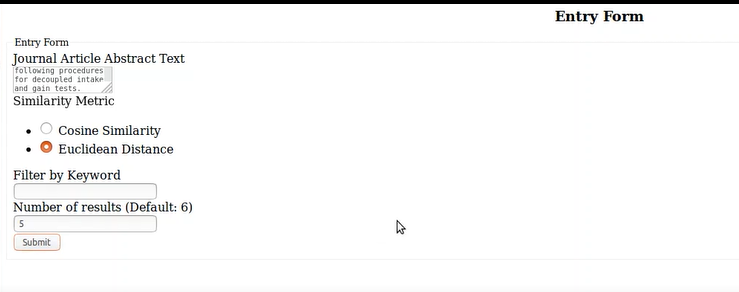
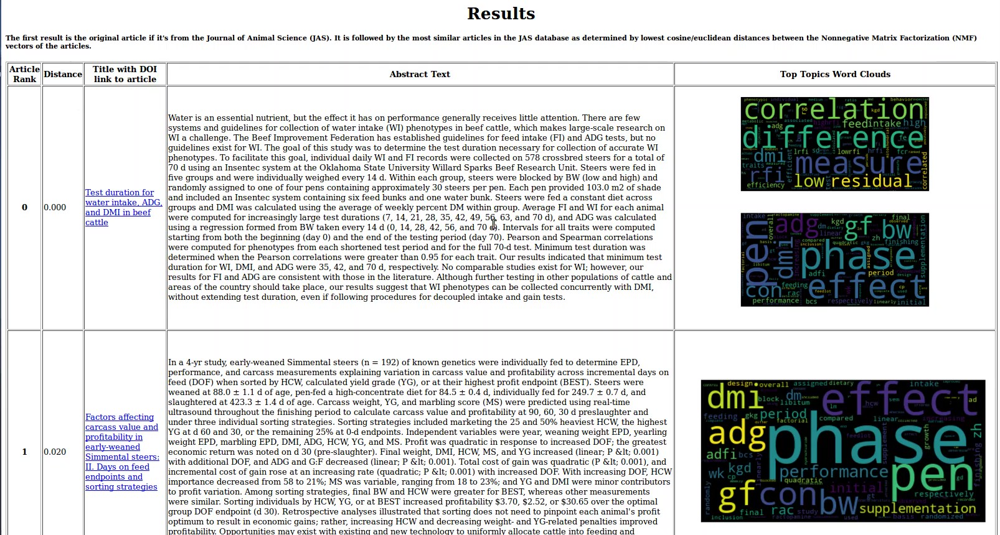

# Journal Article Recommendations

This is a Flask application that takes in an article and returns its most similar articles within the model's database based on NLP of the abstracts and Nonnegative matrix factorization of the vectors into components. 

# How to Use

I included the scraped jsonline file so you can replicate the results. You can find this inside the JAS folder. To get it ready for the application, you need to load it into pandas like in the Clean_Scraped_json notebook and vectorize the results with the topic_modeling notebook. 

Once you have those, you can try the application by running the python script, flasktest.py, and it will deploy on a local test server. Fill out the form with the article abstract text, which kind of distance method you want to use, and any keywords that you want to filter results by.

Upon hitting submit, you will see the top 5 most similar articles. An example below. 

Rank is their rank ordered by ascending distance. Distance is the calculated cosine/euclidean distance, depending on which you chose. Then you can get to see the title with a link to the original article and actual abstract text. Finally, on the right are word clouds that summarize the most relevant components of the article. 

# Background

Journal articles are a great source of information if you are doing research. However, sometimes they might not feel the most accessible, trying to parse through the hundreds of results you may get from a search. For this project, I wonder if I can use unsupervised learning to get more articles similar to an article I am interested in. 

The journal I am most familiar with is the Journal of Animal Science (JAS), so I decided to create a text corpus from all of its articles. It's a good example because it has a fairly long history, with its first issue published in 1917, and the Oxford University Press (UOP) has done a great job digitizing everything. 

While I chose to use the JAS, this is a pipeline that can be easily extended to other fields and journals to make recommendations.

# Data

The OUP has the article abstracts neatly laid out in hierarchical static HTML pages, making Scrapy an ideal tool for gathering my data. My Scrapy spider, abstractspider, can follow links through several levels and extract the information of interest once it reaches the article page. 

The information I extracted from each article were:
* Abstract
* Date published 
* Volume/Issue
* Article Category

You might have noticed that the articles already come with category names, making topic modeling feel a little redundant but they are very broad topics such as Ruminant Nutrition. 

# Topic Modeling with Components
<!-- Fletcher 5 -->
 

The first step is processing text is tokenizing. I chose to use the NLTK library's part-of-speech tagger to tokenize only the nouns in the articles because I'm most interested in the things researchers are investigating, less what they did exactly with those things. 

Second, I vectorized the corpus of text generated using the tfidf vectorizer from Sklearn. Tfidf, which stands for term frequency inverse document frequency, penalizes terms that are common in all documents, thereby uncovering terms that are actually important to specific documents. 

Third, I did topic modeling of the tfidf vectors using a nonnegative matrix factorization (NMF). 
I also tried count vectorizer and running a Latent Dirichlet Allocation (LDA) in an earlier notebook, but I found the NMF components to be more promising and I value being able to use tfidf instead of count vectorizer. I began with 20 components, but expanded to 100 because the 20 components were too broad and captured only things like species differences and broad topics like genetics versus nutrition which are redundant with the article categories. The 100 components produced much more specific topics, though this does come at the cost of some interpretability of the topics. Rather than hand labeling each component, I decided to use a word cloud to visualize the component with its top 100 words. 

# Recommendations

Having vectorized the articles, I can now find the distances between those vectors to find and recommend articles with the smallest distances, as that implies they share emphasis on certain words and are therefore more similar. 

Of course, with an unsupervised learning method like this, there is no score or anything to verify how well the recommendation system is working. The only way is to use the model and see if you are happy with the results. To make that process easier, I interfaced the model with a Flask application. The app loads the pickled model, trained on the Journal of Animal Science corpus, and will make recommendations of articles from that corpus based on the text of an abstract that you input. 

# Conclusion

From my results, I can tell this recommendation system will not be competing with Google Scholar any time soon. However, there is the potential to uncover some less obvious similarities. For example, it noticed that one of the articles I tested involved a compound called zipaterol hydrochloride and returned a bunch of studies also including that compound. If you know exactly what you’re looking for, I would suggest you google, but maybe this can help you explore some other angles to approach your research. 

# Future Directions

One interesting followup would be to take the topics and see how they have evolved over time. For example, in ruminant nutrition, I am curious how much research was done on feeding grain before and after feedlots became prominent. Component 88 might be a relevant topic. 

    88 ['starch', 'grain', 'sorghum', 'digestion', 'barley', 'wheat', 'intestine', 'processing', 'small', 'grains', 'tract', 'intestinal', 'digested', 'potato', 'rolled']
Or component 72 might be relevant for the development of Total Mixed Rations, which are nutritionally balanced feed blended together to guarantee consumption.
     
     72 ['lysine', 'methionine', 'dietary', 'requirement', 'tryptophan', 'threonine', 'llysine', 'diets', 'pst', 'digestible', 'cornsoybean', 'opaque', 'arginine', 'gainfeed', 'linear']

I might revise the word clouds to be bar charts, with bars proportional to word weight, to characterize each component or topic better. This may also help with actually labeling the topics and grouping similar components together to answer questions like the ones I have just mentioned. The application would also benefit from additional styling. 

Lastly, this pipeline can be easily adapted to other journals or text corpora and make recommendations from those corpora. 

Last worked on Aug 27, 2018

